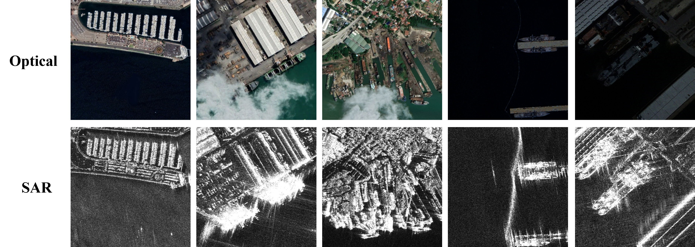

# WMoE-Net

**Wavelet-Directed Cross-Attention Alignment with Mixture-of-Experts Network for Multimodal SAR-Optical Ship Detection**

WMoE-Net is an alignment-gating-fusion framework for oriented ship detection from paired SAR and optical images. It is designed for port and near-shore scenes where residual SAR-optical misalignment, low illumination, clouds/fog, and cluttered backgrounds can make direct multimodal fusion unstable.

The method builds on Ultralytics YOLO and introduces wavelet-directed cross-attention alignment (WCAM), condition-informed quality mixture-of-experts fusion (CIQ-MoE), a condition-informed quality gating network (CIQGN), and a mutually-guided consistency-aware fusion expert (MCFM).

## Highlights

- Dual-stream SAR-optical feature extraction for paired remote-sensing images
- WCAM for local cross-modal alignment under residual registration offsets
- CIQ-MoE with CIQGN for sparse, condition-adaptive modality routing
- MCFM for consistency-guided collaborative feature refinement
- OBB detection head for oriented ship localization
- Representative baseline and ablation YAML files in `ultralytics/cfg/models/fuse`

## Dataset

The QXS-SAROPT-SHIP dataset is available at:

<p align="center">
  
</p>

- Zenodo: https://doi.org/10.5281/zenodo.20000667
- Baidu Disk: https://pan.baidu.com/s/1QbB70BxYquZ2drwubMnPpA

Baidu Disk extraction code: `fkz1fa`

Prepare paired optical and SAR images with matching file names:

```text
datasets/
|-- images/
|   |-- train/
|   `-- val/
|-- imagesSAR/
|   |-- train/
|   `-- val/
`-- labels/
    |-- train/
    `-- val/
```

The default scripts use `datasets/ship.yaml`. Replace it with your own dataset YAML when needed.

## Model Configs

Representative configurations are provided in `ultralytics/cfg/models/fuse`:

```text
wmoenet_wdca3_moe_top2.yaml
wdca3_c3c5_3head.yaml
moe3_top2_3head.yaml
early_feature_add.yaml
early_feature_concat.yaml
mid_feature_fusion.yaml
data_fusion.yaml
decision_fusion.yaml
yolov8-obb.yaml
```

## Training

```bash
python train_dual.py
```

The default model configuration is:

```text
ultralytics/cfg/models/fuse/wmoenet_wdca3_moe_top2.yaml
```

## Validation

```bash
python val_dual.py
```

By default this expects a local checkpoint at:

```text
weights/best.pt
```

## Inference

```bash
python infer_dual.py
```

Prediction outputs are written to `runs/predict/WMoE-Net`.

## Repository Layout

```text
WMoE-Net/
|-- train_dual.py
|-- val_dual.py
|-- infer_dual.py
|-- docs/assets/
|-- ultralytics/
|   |-- cfg/models/fuse/
|   |-- data/
|   |-- engine/
|   |-- models/
|   |-- nn/
|   `-- utils/
`-- README.md
```

## Acknowledgements

This project is developed based on:

- YOLOFuse: https://github.com/WangQvQ/YOLOFuse
- Ultralytics YOLO: https://github.com/ultralytics/ultralytics

We thank the original authors for releasing their code and providing a useful foundation for dual-stream multimodal object detection research.
